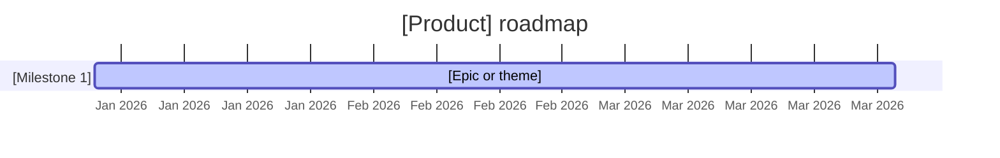

---
# R4A roadmap template (FR-CON-012). Execution plan for ONE vision.
# id: pure ID (ROADMAP-<NNN>), repo-global sequence.
id: ROADMAP-{NNN}
type: roadmap
status: draft
version: 0.1
last_updated:
owner:
# parent_vision: REQUIRED — the vision this roadmap executes
parent_vision: VIS-{NNN}
# see_also:
# open_questions: SSOT for unresolved points — each entry carries a local ID (Q-1, Q-2, …),
# unique within this artifact, never reused; the Open questions section mirrors this list
# open_questions:
#   - "Q-1: Question that must be answered before approval"
---

# Roadmap: [Product / stream name]

> Executes [VIS-{NNN} — vision title](VIS-{NNN}-slug.md). Each milestone names the vision goal(s) it serves.

---

## Timeline

---

## Milestone: [Name] — [date range]

**Theme:** [What this milestone is about.]
**Vision goals served:** [G1, G3 from VIS-{NNN}]
**Target release:** [release id, aligned with releases/<version>.yaml if it exists]

| Epic | Status | Notes |
|------|--------|-------|
| [EPIC-{DOMAIN}-{NNN} title](../domains/.../epics/EPIC-{DOMAIN}-{NNN}-slug.md) | planned | — |

---

## Backlog (not committed)

| Item | Vision goal |
|------|-------------|
| [Candidate epic/theme] | [G#] |

---

## Open questions

<!-- SSOT is frontmatter `open_questions` (Q-<N> entries); mirror them here with context — never edit
     this section independently; validate checks the mirror. Blocking ones keep the roadmap in draft. -->

- [Q-1: Question — what's needed to resolve it]

---

## Decisions

<!-- Optional. Every resolved open question lands here as a decision record with provenance:
     "Decision (owner-decided | agent-recommended, owner-accepted, YYYY-MM-DD): Q-<N> — <what was decided>".
     An open question may only leave `open_questions` when a record referencing its Q-ID appears here. -->

- [Decision record — or remove this section if no decisions yet]

---

## Change log

| Version | Date | Author | Notes |
|---------|------|--------|-------|
| 0.1 | YYYY-MM-DD | [author] | Initial draft |
